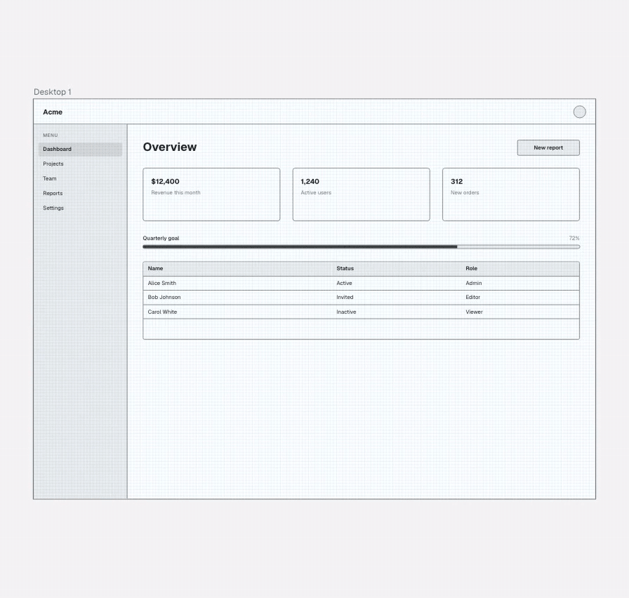
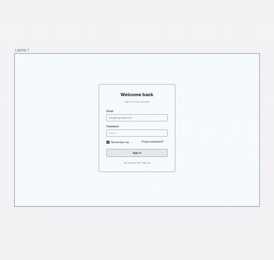
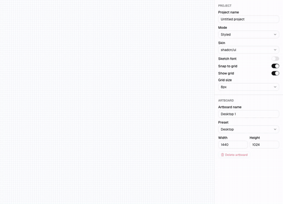
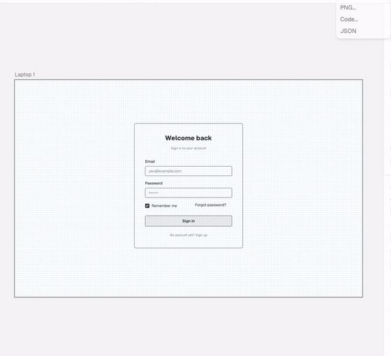

<div align="center">

<a href="https://polyframe.vercel.app">
  
</a>

# Polyframe

### Sketch it once. Wear any UI kit. Ship the code.

Drag-and-drop UI prototyping in your browser. Build a layout as a wireframe, flip it into<br/>
**shadcn/ui · MUI · Mantine · Ant Design · Bootstrap** in one click, export PNG or React code.

**No sign-up. No backend. Your work never leaves your browser.**

[**Open the editor →**](https://polyframe.vercel.app) &nbsp;·&nbsp;
[Spec](./docs/SPEC.md) &nbsp;·&nbsp;
[Roadmap](#-roadmap) &nbsp;·&nbsp;
[Contribute](#-contributing)

[](./LICENSE)
[](https://github.com/bvffblvde/polyframe/actions)
[](https://github.com/bvffblvde/polyframe/stargazers)
[](./CONTRIBUTING.md)
[](https://u24.gov.ua)

English · [Українська](./README.uk.md)

<br/>



</div>

---

## ✨ Why Polyframe?

Most wireframe tools give you gray boxes. Most UI builders lock you into one design system.
Polyframe keeps **one layout** and lets you see it in **many visual languages**, so you can think about structure first and pick a look later.

- 🧠 **Wireframe first.** Sketchy, grayscale, distraction-free. Focus on layout, not pixels.
- 🎭 **One click, six looks.** The same screen in shadcn/ui, MUI, Mantine, Ant Design and Bootstrap. Your data never changes; only the skin does.
- 🧾 **Export real code.** Get a React component for **shadcn/ui + Tailwind**, **MUI**, **Mantine**, **Ant Design**, **React Bootstrap** or **Chakra UI** as a starting point, not a screenshot.
- 🔒 **Local-first.** Projects live in IndexedDB. Share via a link that stores the whole layout in the URL itself, with no server involved.
- ⌨️ **Keyboard-driven.** Undo/redo, nudge, align, group, duplicate, ⌘K for everything.
- 🚀 **Starter templates.** Login, dashboard, landing hero, settings, pricing and a mobile profile.
- 🌍 **English & Ukrainian** out of the box.

## 🎬 See it in action

| Wireframe → Styled | Drag, snap & guides | Export to code |
|:---:|:---:|:---:|
|  |  |  |

## 🧩 Features

**Canvas**
- Infinite pan & zoom canvas with **artboards** (Desktop, Laptop, Tablet, Mobile, custom)
- Free drag or **grid snap** (4 / 8 / 16 px), **smart guides** with distance labels
- Multi-select, marquee, resize with handles, align & distribute, z-order, groups
- Undo/redo for every gesture

**Components (24 and growing)**
`Box` `Card` `Divider` `Navbar` `Sidebar` · `Button` `Input` `Textarea` `Select` `Checkbox` `Radio` `Switch` `Slider` · `Heading` `Text` `Link` `Badge` · `Image` `Avatar` `Icon` · `Table` `Tabs` `Alert` `Progress`

**Inspector & layers**
- Property panel generated from each component's schema
- Layers tree with rename, lock, hide, drag to reorder
- Command palette (`⌘K`) for inserting components, switching skins, exporting and more

**Export & share**
- PNG at 1× / 2× / 3×, a single artboard or all of them as a zip
- JSON project files with schema validation and migrations
- React code: absolute layout (faithful) or stacked layout (flex rows)
- Read-only share links and a viewer for phones and tablets

## 🚀 Quick start

Just use it: **[polyframe.vercel.app](https://polyframe.vercel.app)**

Or run it locally:

```bash
git clone https://github.com/bvffblvde/polyframe.git
cd polyframe
pnpm install
pnpm dev
```

Open http://localhost:3000. Requires Node 22+ and pnpm (run `corepack enable` to get the pinned version).

<details>
<summary><b>Scripts</b></summary>

```bash
pnpm dev            # dev server
pnpm build          # production build
pnpm lint           # ESLint
pnpm typecheck      # tsc --noEmit
pnpm test           # Vitest unit and component tests
pnpm test:coverage  # with coverage thresholds for ops and geometry
pnpm test:e2e       # Playwright
```

The generated code is type-checked in a separate package, see [exporter-check](./exporter-check/README.md).

</details>

## ⌨️ Shortcuts

| Action | Mac | Windows / Linux |
|---|---|---|
| Undo / Redo | `⌘Z` / `⌘⇧Z` | `Ctrl+Z` / `Ctrl+Shift+Z` |
| Duplicate | `⌘D` | `Ctrl+D` |
| Group / Ungroup | `⌘G` / `⌘⇧G` | `Ctrl+G` / `Ctrl+Shift+G` |
| Toggle grid snap | `G` | `G` |
| Toggle wireframe / styled | `M` | `M` |
| Zoom to fit | `⌘0` | `Ctrl+0` |
| Command palette | `⌘K` | `Ctrl+K` |
| All shortcuts | `?` | `?` |

## 🏗️ How it works

```
            ┌──────────────┐
  drag  ──▶ │  JSON layout │ ──▶ skin tokens (CSS vars) ──▶ Wireframe · shadcn · MUI · Mantine · Ant · Bootstrap
            │ (one source) │
            └──────┬───────┘
                   └──────▶ exporters ──▶ React code for shadcn/ui · MUI · …
```

Polyframe **does not bundle the real UI libraries**. Each component is rendered once from a JSON schema and styled with **design tokens** that imitate each kit. This keeps the app fast, makes skin switching instant, and lets the exporters emit real library code.

<details>
<summary><b>Tech stack</b></summary>

Next.js (App Router) · React 19 · TypeScript · Tailwind CSS v4 · shadcn/ui (Radix) · Zustand + zundo · dnd-kit · Zod · next-intl · idb-keyval · lz-string · html-to-image · fflate · Prettier · Shiki · cmdk · Vitest · Testing Library · Playwright

</details>

## 🗺️ Roadmap

- [x] Spec & architecture
- [x] **v0.1 MVP**: canvas, 24 components, 5 skins + wireframe, inspector, layers, undo/redo, PNG/JSON export
- [x] **v0.2**: code export (shadcn/ui, MUI), share links, ⌘K, smart guides, groups, templates
- [ ] **v0.3**: ~~Mantine / Ant / Bootstrap / Chakra exporters~~ (done), user guide, docs site, PWA
- [ ] **Later**: Storybook matrix, auto-layout containers, custom skin editor, token import, SVG export

Have an idea? [Open a discussion](https://github.com/bvffblvde/polyframe/discussions).

## 🤝 Contributing

Contributions are very welcome, and the codebase is designed for it. Each **component**, **skin** and **export target** is a single folder following a documented contract.

- 🟢 Start with a [`good first issue`](https://github.com/bvffblvde/polyframe/labels/good%20first%20issue)
- 📦 [Add a new component](./docs/contributing/add-component.md) in ~30 minutes
- 🎨 [Add a new skin](./docs/contributing/add-skin.md)
- 🧾 [Add an export target](./docs/contributing/add-exporter.md)

Please read [CONTRIBUTING.md](./CONTRIBUTING.md) first. We use Conventional Commits.

## ⭐ Support

If Polyframe saves you time, **give it a star**. It really helps the project get discovered.

<a href="https://star-history.com/#bvffblvde/polyframe&Date">
  
</a>

## 📄 License

[MIT](./LICENSE) © [Vladyslav Horba](https://vladyslav-horba-portfolio.vercel.app)

<sub>Polyframe is not affiliated with shadcn/ui, MUI, Mantine, Ant Design or Bootstrap. Skins are visual approximations; all trademarks belong to their owners.</sub>

<div align="center">
<sub>Built with ☕ in Kharkiv, Ukraine 🇺🇦</sub>
</div>